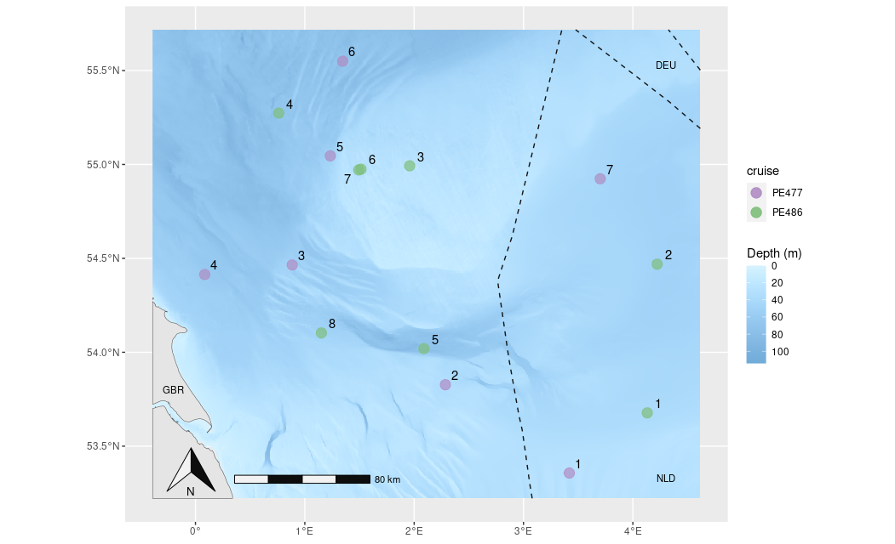

# R script to create a map of the North Sea including some sampling stations

[](http://lifewatch.be) [](https://mybinder.org/v2/gh/lifewatch/map-virus-north-sea/HEAD?urlpath=rstudio)

Includes the sampling stations, bathymetry from [EMODnet](https://emodnet.ec.europa.eu/en) and maritime boundaries from [MarineRegions.org](https://marineregions.org/)

## Get Started 🚀

-   Clone this repository
-   Open the `map-virus-north-sea.Rproj` file with [RStudio](https://posit.co/)
-   Open the script at `./R/map-virus-north-sea.R`
-   Use [renv](https://rstudio.github.io/renv/index.html) to get the packages needed for this project.

``` r
# install.packages("renv@0.15.4")
renv::restore()
```

-   Run the script and save the output map using RStudio

## Directory structure 📁

```         
map-virus-north-sea/
├── data/ - directory to save data and read local files from
    ├── raw/ - if any local file is needed, save here
    └── derived/ - save outputs here
├── R/ - scripts
├── LICENSE.md - License of this software
├── .gitignore
├── Dockerfile - requirement to open the project on binder, uses rocker/binder image
├── install.R - scripts to be run by binder to set up the dependencies of the project
├── README.md
├── map-virus-north-sea.Rproj.Rproj - open this file to start the project
└── renv.lock - this file is used by renv to record the dependencies used by the project
```

## An output example 🗺️



This image is at: `./data/derived/`

## How to cite 📝

> Fernández-Bejarano, S. (2023) R script to create a map of the North Sea including some sampling stations. <https://github.com/lifewatch/map-virus-north-sea>

License: MIT
